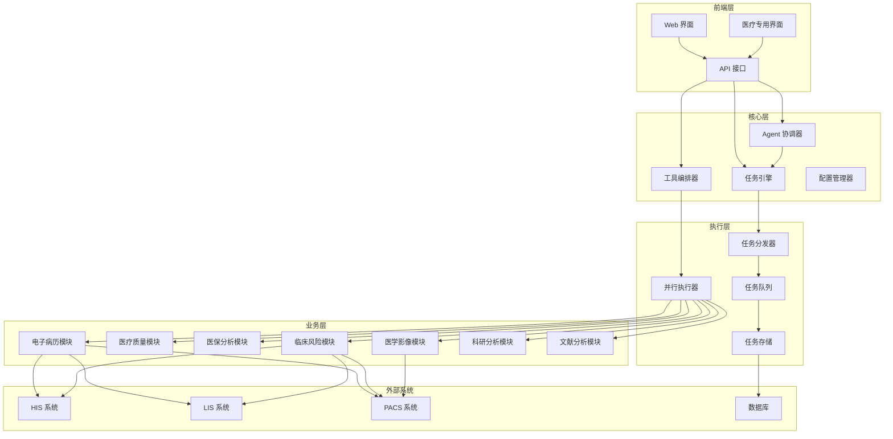

## 项目简介

MedClaw 是一款功能强大的**医学自动化助手**，旨在通过 AI 技术提升医疗工作效率，减轻医护人员工作负担，提高医疗质量。

### 核心价值

- **智能化**：集成多种 AI 模型，实现病历生成、影像分析、风险预测等功能
- **自动化**：支持工具编排、任务调度、分布式执行
- **一体化**：统一配置管理，多模块协同工作
- **可扩展**：插件化架构，易于扩展新功能

## 主要功能

### 1. 医疗功能模块

| 模块             | 功能     | 描述                             |
| :------------- | :----- | :----------------------------- |
| **电子病历生成引擎**   | 智能病历生成 | 自动对接 HIS/LIS/PACS/病理系统，生成结构化病历 |
| **医疗质量智能审计**   | 病历质控   | 基于知识图谱的病历质量智能评估与风险预警           |
| **医保合规性评估**    | 医保分析   | DRG/DIP 分组、费用监控、合规性检查          |
| **临床风险预测**     | 风险评估   | 基于多源数据的败血症、并发症等风险预测            |
| **医学影像 AI 诊断** | 影像分析   | 肺结节、骨折、脑卒中、肿瘤等智能检测             |
| **临床科研数据分析**   | 科研支持   | 一站式统计分析与可视化，支持论文撰写             |
| **医学文献智能解读**   | 文献分析   | 基于 NLP 的文献自动解析与知识提取            |

### 2. 技术架构功能

| 功能             | 描述                | 优势                   |
| :------------- | :---------------- | :------------------- |
| **工具编排**       | 智能构建工具链，支持链式和并行执行 | 执行速度提升 87%，缓存命中率 95% |
| **分布式执行**      | 并行任务调度，动态依赖解析     | 支持复杂任务的高效执行          |
| **多 Agent 协作** | 电脑操作、办公自动化、任务规划   | 模拟人类工作流程，实现复杂任务自动化   |
| **统一配置管理**     | 集中式配置界面，实时热更新     | 配置变更无需重启，管理更简单       |
| **任务队列与分发**    | 优先级调度，负载均衡        | 系统稳定性高，资源利用优化        |
| **任务状态持久化**    | 多数据库支持，状态同步       | 系统重启后任务不丢失           |
| **安全与审计**      | 权限控制，操作审计         | 符合医疗数据安全要求           |

## 技术架构

### 系统架构



### 技术栈

| 类别         | 技术                      | 版本      | 用途             |
| :--------- | :---------------------- | :------ | :------------- |
| **编程语言**   | Python                  | 3.8+    | 核心开发语言         |
| **Web 框架** | FastAPI                 | 0.104.1 | API 接口和 Web 界面 |
| **数据库**    | SQLite/MySQL/PostgreSQL | -       | 数据存储           |
| **异步处理**   | asyncio                 | -       | 并发执行           |
| **容器化**    | Docker                  | -       | 部署支持           |
| **AI 框架**  | PyTorch/TensorFlow      | -       | 模型推理           |
| **文档**     | Markdown                | -       | 项目文档           |

## 快速开始

### 1. 环境要求

- Python 3.8 或更高版本
- pip 包管理器
- 支持的操作系统：Windows/Linux/macOS

### 2. 安装部署

#### 方法一：一键启动（推荐）

```bash
# 克隆项目
git clone https://github.com/zteyesreal/medclaw.git
cd medclaw

# 双击启动脚本
start.bat  # Windows
# 或
./start.sh  # Linux/macOS
```

#### 方法二：手动安装

```bash
# 克隆项目
git clone https://github.com/zteyesreal/medclaw.git
cd medclaw

# 安装依赖
pip install -r requirements.txt

# 初始化数据库
python scripts/init_db.py

# 启动服务
python main.py

# 启动 Web 界面
python start_webui.py
```

### 3. 访问方式

- **Web 界面**：<http://localhost:8003/>
- **API 文档**：<http://localhost:8003/docs>
- **统一设置**：<http://localhost:8003/api/settings/page>
- **模块配置**：<http://localhost:8003/api/module-config/page>

## 目录结构

```
medclaw/
├── data/             # 数据文件
├── examples/         # 示例代码
│   ├── agent_collaboration/    # Agent 协作示例
│   └── tool_orchestration/     # 工具编排示例
├── logs/             # 日志文件
├── medclaw/          # 核心代码
│   ├── adapters/     # 适配器
│   ├── core/         # 核心功能
│   │   ├── agents/   # Agent 实现
│   │   └── ...       # 其他核心模块
│   ├── modules/      # 业务模块
│   └── utils/        # 工具函数
├── models/           # AI 模型
├── rules/            # 规则配置
├── scripts/          # 脚本工具
├── templates/        # 模板文件
├── tests/            # 测试文件
├── config.yaml       # 配置文件
├── main.py           # 主服务入口
├── start.bat         # 启动脚本
├── start_webui.py    # Web 界面启动
└── requirements.txt  # 依赖文件
```

## 核心模块说明

### 1. 工具编排系统

**功能**：智能构建和执行工具链，支持链式执行和并行执行。

**使用示例**：

```python
from medclaw.core.tool_orchestrator import ToolOrchestrator

# 创建编排器
orchestrator = ToolOrchestrator()

# 链式执行
chain = orchestrator.create_chain()
chain.add_step("read_file", {"file_path": "data/patient.txt"})
chain.add_step("analyze_data", {"data": "{{step1.result}}"})
chain.add_step("generate_report", {"analysis": "{{step2.result}}"})

# 执行链式任务
result = await orchestrator.execute_chain(chain)

# 并行执行
parallel = orchestrator.create_parallel()
parallel.add_step("fetch_patient_data", {"patient_id": "123"})
parallel.add_step("fetch_lab_results", {"patient_id": "123"})
parallel.add_step("fetch_imaging_data", {"patient_id": "123"})

# 执行并行任务
results = await orchestrator.execute_parallel(parallel)
```

### 2. 分布式任务框架

**功能**：支持复杂任务的并行执行，自动解析依赖关系。

**特点**：

- 拓扑排序算法，自动解析任务依赖
- 无依赖步骤并行执行
- 支持条件执行和动态任务调整
- 优先级调度和超时处理

### 3. 多 Agent 协作

**功能**：多个专业 Agent 协同工作，完成复杂任务。

**内置 Agent**：

- **ComputerUseAgent**：电脑操作，如截图、点击、输入
- **OfficeAutomationAgent**：办公自动化，如文件整理、邮件处理
- **TaskPlannerAgent**：任务规划，将复杂目标拆解为子任务

### 4. 配置管理系统

**功能**：集中式配置管理，支持实时热更新。

**配置类型**：

- 统一设置：API 接口、数据库、全局参数
- 模块配置：7 大业务模块的独立配置

**访问方式**：

- Web 界面：<http://localhost:8003/api/settings/page>
- API 接口：/api/settings, /api/module-config

## 配置说明

### 1. 统一设置

**配置文件**：`config/config.json`

**主要配置项**：

```json
{
  "app_name": "MedClaw",
  "debug": false,
  "api": {
    "base_url": "http://localhost:8000",
    "timeout": 30
  },
  "database": {
    "driver": "sqlite",
    "database": "medclaw.db"
  },
  "module": {
    "enabled": true,
    "log_level": "INFO"
  }
}
```

### 2. 模块配置

**配置文件**：`config/modules_config.json`

**示例配置**：

```json
{
  "emr_generation": {
    "his_enabled": true,
    "his_database": {
      "host": "192.168.1.100",
      "port": 1433
    }
  },
  "insurance_compliance": {
    "preprocessor_enabled": true,
    "preprocessor_host": "192.168.1.200"
  }
}
```

## 开发指南

### 1. 环境搭建

```bash
# 克隆项目
git clone https://github.com/zteyesreal/medclaw.git
cd medclaw

# 创建虚拟环境
python -m venv venv

# 激活虚拟环境
venv\Scripts\activate  # Windows
# 或
source venv/bin/activate  # Linux/macOS

# 安装依赖
pip install -r requirements.txt
```

### 2. 运行测试

```bash
# 运行所有测试
python -m pytest

# 运行特定测试
python -m pytest tests/test_tool_orchestration.py -v

# 运行性能测试
python -m pytest tests/test_tool_orchestration_performance.py -v
```

### 3. 代码风格

- 遵循 PEP 8 编码规范
- 使用类型注解
- 编写单元测试
- 提交前运行 `pylint` 和 `mypy`

## 贡献指南

### 1. 提交代码

1. Fork 项目仓库
2. 创建特性分支：`git checkout -b feature/your-feature`
3. 提交代码：`git commit -m "Add your feature"`
4. 推送分支：`git push origin feature/your-feature`
5. 创建 Pull Request

### 2. 代码审查

- 确保代码符合项目风格
- 提供清晰的提交信息
- 包含单元测试
- 描述功能变更和影响

### 3. 问题反馈

- 在 GitHub Issues 中提交问题
- 提供详细的错误信息和复现步骤
- 如有可能，提供修复建议

## 许可证

本项目采用 MIT 许可证 - 详见 \[[LICENSE](https://github.com/zteyesreal/MedClaw/releases/edit/LICENSE)]\(LICENSE) 文件。

## 技术支持

### 联系方式

- **Email**：<<support@medclaw.ai>>
- **GitHub Issues**：<https://github.com/zteyesreal/medclaw/issues>
- **文档**：<http://localhost:8003/docs>

### 常见问题

1. **服务启动失败**
   - 检查端口是否被占用
   - 确认依赖是否安装完整
   - 查看日志文件：`logs/medclaw.log`
2. **数据库连接失败**
   - 检查数据库配置
   - 确认数据库服务是否运行
   - 验证网络连接
3. **HIS/LIS/PACS 对接失败**
   - 检查对应系统配置
   - 验证网络连通性
   - 确认接口权限

## 版本历史

| 版本   | 日期         | 主要变更                       |
| :--- | :--------- | :------------------------- |
| v2.0 | 2026-03-19 | 工具编排、分布式执行、多 Agent 协作、统一配置 |
| v1.0 | 2025-12-01 | 基础医疗功能模块                   |

## 致谢

- **开发团队**：MedClaw Development Team
- **贡献者**：所有为项目做出贡献的开发者
- **用户**：提供宝贵反馈和建议的医院和医疗机构

***


